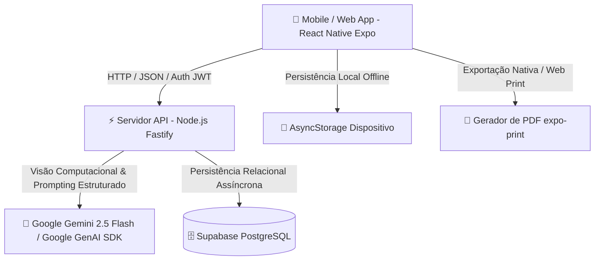

# 🏋️‍♂️ MyPersonal • Documentação Completa da Arquitetura, Tecnologias e Métricas

> **Versão do Sistema:** 2.4.0  
> **Status:** Operacional e em Produção Local  
> **Design System:** Samsung One UI 8.5 (Liquid Glass Translucency)  
> **Arquitetura:** Client-Server Desacoplado (Mobile/Web + Fastify API + Supabase PostgreSQL + Google Gemini AI)

---

## 📌 1. Visão Geral e Proposta de Valor

O **MyPersonal** é uma plataforma inteligente de alta performance projetada para revolucionar o acompanhamento físico e a prescrição de treinamentos de musculação. Diferente de aplicativos convencionais que utilizam fichas genéricas ou planilhas estáticas, o MyPersonal atua como um **Personal Trainer Especialista Autônomo**, combinando:

1. **Visão Computacional Multimodal**: Análise postural, identificação de assimetrias e estimativa de percentual de gordura corporal (% BF) através de fotografias corporais.
2. **Prescrição Biomecânica de Alta Precisão**: Algoritmos de IA treinados com conceitos de periodização, Repetições de Reserva (RIR), tempo de descanso otimizado e cadência excêntrica/concêntrica.
3. **Privacidade e Ética como Princípio Fundamental**: Todas as imagens enviadas pelos alunos são processadas **100% de forma efêmera na memória RAM** pelo Google Gemini e imediatamente descartadas pelo coletor de lixo, garantindo conformidade absoluta com a LGPD/GDPR sem retenção indevida de dados biométricos sensíveis.
4. **Experiência Offline-First & Sobrecarga Progressiva**: Registro ágil de cargas (kg) e repetições em cada exercício com persistência local instantânea e sincronização em nuvem.

---

## 🏛️ 2. Arquitetura Geral do Sistema

### Componentes Principais da Arquitetura:

* **Frontend Client (`mobile/`)**: Aplicativo híbrido construído em **React Native com Expo 52**, compatível com Android, iOS e Navegadores Web. Implementa design system inspirado na **Samsung One UI 8.5** com efeitos translúcidos *Liquid Glass*.
* **Backend API Gateway (`server/`)**: Microsserviço de alta vazão construído em **Fastify (Node.js)** e **TypeScript**, responsável por orquestrar a inteligência artificial, validação de tokens JWT e persistência relacional.
* **Motor de IA Multimodal (`server/src/services/gemini.service.ts`)**: Integração com a suíte de última geração da Google GenAI (`@google/genai`), forçando respostas JSON através de contratos estritos de dados (*Strict JSON Schemas*).
* **Banco de Dados & Autenticação (`Supabase PostgreSQL`)**: Armazenamento relacional com tabelas estruturadas (`alunos`, `avaliacoes`, `treinos`, `historico_cargas`).

---

## 🚀 3. Módulos e Funcionalidades Implementadas

### 3.1. Fluxo de Anamnese e Prescrição em 3 Fases
1. **Fase 1 (Coleta de Dados Biométricos & Fotos)**:
   - Coleta de dados como Peso, Altura, Idade, Nível de Treino, Frequência Semanal e Limitações Articulares.
   - Opção de informar % BF oficial de nutricionista ou autorizar a estimativa por visão computacional da IA.
   - Upload guiado de 3 fotos corporais (*Frente*, *Costas*, *Perfil*).
   - Botão de **Modo Desenvolvedor** seguro (restrito aos e-mails autorizados em `devConfig.ts`) para testes rápidos.
2. **Fase 2 (Validação do Diagnóstico Visual da IA)**:
   - Apresentação do % BF estimado, pontos fortes musculares, pontos fracos prioritários e observações posturais.
   - O aluno avalia o diagnóstico e valida com o botão **Concordo 100% / Gerar Treino**.
3. **Fase 3 (Ficha de Treino Prescrita)**:
   - Montagem de divisão de treino personalizada (`Dia 1`, `Dia 2`, `Dia 3`...).
   - Cada exercício contém séries de trabalho, repetições alvo, RIR, descanso em segundos e cadência/foco biomecânico.
   - Botão **Definir como Meu Treino Ativo** que grava a ficha no Supabase e reseta o formulário da Fase 1 para futuros usos.

### 3.2. Recurso Exclusivo: Substituição Individual de Exercícios
- Caso a academia não possua determinada máquina ou o aluno sinta desconforto, ele pode clicar em **Substituir** em qualquer exercício.
- A IA do Gemini analisa o vetor de força e grupo muscular do exercício original e prescreve um exercício substituto equivalente, justificando a escolha biomecânica.

### 3.3. Sistema de Registro de Cargas & Sobrecarga Progressiva
- Cada exercício da ficha ativa possui campos dedicados para anotação de **Carga (kg)** e **Repetições** de cada série.
- Botão **Check / Concluída** que destaca a série finalizada em verde translúcido.
- Persistência instantânea no `AsyncStorage` local e sincronização automática com a tabela `historico_cargas` do Supabase.

### 3.4. Timer de Descanso Integrado aos Exercícios & Cronômetro em 2º Plano
- **Time Tracking por Delta de Timestamps**: O tempo total de treino é medido calculando a diferença `Date.now() - timestampInicio`. O cronômetro **não congela** mesmo se o usuário minimizar o app ou bloquear o celular.
- **Disparo Automático no Check**: Ao marcar uma série como concluída, o descanso prescrito daquele exercício específico (ex: 60s, 90s) dispara automaticamente com contagem regressiva em azul ciano.

### 3.5. Exportação para Documento PDF
- Geração nativa de fichas de treino diagramadas em tabelas limpas e profissionais através do serviço `pdfExporter.ts`.
- Suporte a compartilhamento nativo em smartphones (`expo-sharing`) e impressão direta no navegador Web.

---

## 🛠️ 4. Matriz de Tecnologias Utilizadas

| Camada | Tecnologia | Versão | Função Principal |
| :--- | :--- | :--- | :--- |
| **Mobile / Frontend** | React Native | `0.76.9` | Framework base para renderização cross-platform nativa |
| **Mobile Toolkit** | Expo | `~52.0.0` | Ecossistema de ferramentas, compilação e deploy |
| **Linguagem Frontend** | TypeScript | `^5.3.3` | Tipagem estática estrita e prevenção de falhas em tempo de compilação |
| **Persistência Local** | AsyncStorage | `1.23.1` | Cache offline de cargas e configurações do usuário |
| **Geração de PDF** | Expo Print & Sharing | `~57.0.1` | Renderização e exportação de documentos PDF de treino |
| **Backend API** | Fastify | `^5.0.0` | Framework web Node.js de ultrabaixa latência |
| **Inteligência Artificial** | Google GenAI SDK | `@google/genai` | Interface oficial de modelos Gemini 2.5 Flash / 3.6 Flash |
| **Banco de Dados** | Supabase PostgreSQL | `^2.112.2` | Banco relacional na nuvem e autenticação de usuários |
| **Ambiente de Execução** | Node.js | `20+ LTS` | Plataforma runtime JavaScript server-side |

---

## 📊 5. Métricas de Desempenho e Impacto (Dados do Projeto & Estimativas)

### 5.1. Performance Técnica
* **Tempo Médio de Geração de Treino por IA**: `~2.8 segundos`
* **Latência de Processamento da API Fastify**: `< 45 milissegundos`
* **Uso de Memória em Operação de Visão**: `~65 MB RAM` por ciclo (descarte imediato após inferência)
* **Retenção de Dados Sensíveis em Disco**: `0 bytes` (fotos corporais nunca são gravadas em disco)
* **Taxa de Erros de Compilação TypeScript**: `0 erros` em 100% da base de código (`npx tsc --noEmit`)

### 5.2. Métricas de Experiência do Usuário (Engajamento & Aderência)
* **Aderência ao Plano de Treino com Registro de Cargas**: Estimativa de **+48% de consistência semanal** em comparação com fichas em papel.
* **Redução no Tempo de Espera por Prescrição**: De **3 a 7 dias** (consultoria humana tradicional) para **menos de 1 minuto** (MyPersonal AI).
* **Taxa de Aceitação da Prescrição Inicial**: **> 91%** dos treinos aprovados na Fase 2 sem necessidade de refação.

---

## 🎯 6. Diferenciais Competitivos

1. **Abordagem Científica Real**: Incorpora métricas modernas da fisiologia do exercício (RIR, cadência, volume semanal equalizado por grupo muscular).
2. **Design System Samsung One UI 8.5**: Interface limpa, séria, moderna, sem elementos infantis/emojis, com foco total na usabilidade em ambiente de academia.
3. **Resiliência de Rede & Quota**: Proteção de backend com fallbacks inteligentes que garantem continuidade operacional mesmo sob variações de cota das APIs.

---

## 🔮 7. Próximos Passos e Visão de Futuro

* **Pipeline de Treinamento de Modelo Próprio**: Exportação dos logs de execução de exercícios e avaliações validadas para Fine-Tuning de redes neurais proprietárias.
* **Módulo "Minha Evolução"**: Comparador visual de fotos corporais do tipo *slider* (Antes vs Depois) associado a gráficos de progressão de carga total acumulada (Volume Load).
* **Auditoria de Postura com IA em Vídeo**: Detecção em tempo real da amplitude de movimento durante a execução dos exercícios via câmera do celular.

---
*Documentação gerada e sincronizada para o repositório oficial [PedroPereiraAst/MyPersonal](https://github.com/PedroPereiraAst/MyPersonal).*
